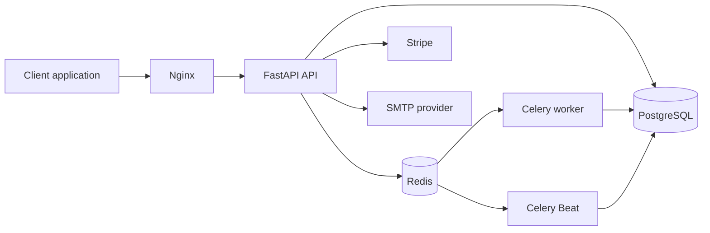

<div align="center">

# 🎬 Online Cinema API

### A production-oriented asynchronous backend for a modern streaming platform

[](https://github.com/Maksym-Dazidov/online-cinema/actions/workflows/ci.yml)
[](https://www.python.org/)
[](https://fastapi.tiangolo.com/)
[](https://www.postgresql.org/)
[](https://www.docker.com/)

[Repository](https://github.com/Maksym-Dazidov/online-cinema) · [Quick Start](#-quick-start-with-docker) · [API Docs](#-api-documentation-and-endpoints) · [Deployment](#-production-deployment) · [CI/CD](#-cicd)

</div>

> [!IMPORTANT]
> This is a backend API. It exposes interactive Swagger documentation at `/docs` after startup and is designed to be consumed by a separate web or mobile client.

Online Cinema API covers the complete customer journey: registration and email activation, JWT authentication, movie discovery, a cart, orders, Stripe payments, and access to purchased movies. It also provides role-based moderator and administrator workflows for managing catalogue content and users.

| ⚡ Async-first | 🔐 Secure by design | 🚀 Ready to ship |
| --- | --- | --- |
| FastAPI, async SQLAlchemy, asyncpg, Redis, and aiosmtplib | JWT, bcrypt hashing, signed Stripe webhooks, role-based permissions | Docker, Nginx, health checks, migrations, Celery, GitHub Actions, EC2 deployment |

## Contents

- [Technology](#-technology)
- [Core Features](#-core-features)
- [Architecture](#-architecture)
- [Quick Start with Docker](#-quick-start-with-docker)
- [Local Development](#-local-development)
- [Environment Variables](#-environment-variables)
- [Authentication and Roles](#-authentication-and-roles)
- [API Documentation and Endpoints](#-api-documentation-and-endpoints)
- [Production Deployment](#-production-deployment)
- [CI/CD](#-cicd)
- [Project Structure](#-project-structure)

## 🧰 Technology

- **FastAPI** and **Uvicorn** for the asynchronous HTTP API
- **SQLAlchemy 2.0 async** with **asyncpg** and **PostgreSQL 16**
- **Alembic** for schema migrations
- **Pydantic Settings** for typed configuration
- **JWT** access and refresh tokens with secure password hashing
- **Celery** and **Redis** for scheduled background work
- **aiosmtplib** for asynchronous email delivery
- **Stripe** Checkout and webhook processing
- **Docker Compose**, **Nginx**, and a non-root runtime image for deployment
- **GitHub Actions** for quality checks and EC2 deployment

## ✨ Core Features

### User lifecycle and security

- Email/password registration with email activation links
- Password reset flow with expiring tokens
- JWT access and refresh tokens
- User profile management
- Role-based access control with `user`, `moderator`, and `admin` groups
- Automatic initial-admin provisioning for a fresh database through environment variables

### Catalogue and community

- Public movie, genre, actor, and review endpoints
- Movie-to-genre and movie-to-actor relationships
- Moderator-managed movie, actor, and genre creation
- Administrator-only destructive operations and role assignment
- Reviews editable and removable only by their author
- Per-user favourites

### Commerce and access control

- Per-user shopping carts
- Order creation from cart contents
- Order cancellation and payment tracking
- Stripe Checkout session creation and signed webhook handling
- Purchased-movie access records protected by a database uniqueness constraint
- Authenticated stream-access endpoint that verifies publication state, free access, or ownership

### Reliability and operations

- Fully asynchronous database sessions and HTTP/email I/O where supported by libraries
- PostgreSQL connection health checks and connection-pool safeguards
- Automatic Alembic migrations before application startup
- Celery Beat cleanup of expired activation and password-reset tokens
- Health endpoint at `GET /health`
- Separate Docker Compose configurations for development and production

## 🏗️ Architecture



## 🐳 Quick Start with Docker

Docker is the recommended way to run the application locally.

### Prerequisites

- Docker Desktop or Docker Engine with Docker Compose v2
- Git

### 1. Clone the [repository](https://github.com/Maksym-Dazidov/online-cinema)

```shell
git clone https://github.com/Maksym-Dazidov/online-cinema.git
cd online-cinema
```

### 2. Create development configuration

```shell
cp .env.dev.example .env.dev
```

On Windows PowerShell:

```powershell
Copy-Item .env.dev.example .env.dev
```

Set real values for Stripe and SMTP in `.env.dev`. For a new local database, also change the initial administrator credentials.

### 3. Start the development stack

```shell
docker compose --env-file .env.dev -f compose.dev.yml up --build
```

The API will be available at:

```text
http://localhost:8000
```

The development stack includes PostgreSQL, Redis, FastAPI with reload, a migration job, Celery worker, and Celery Beat. PostgreSQL and Redis ports are exposed for local debugging.

### Useful development commands

```shell
docker compose --env-file .env.dev -f compose.dev.yml logs -f api
docker compose --env-file .env.dev -f compose.dev.yml logs -f worker
docker compose --env-file .env.dev -f compose.dev.yml down
docker compose --env-file .env.dev -f compose.dev.yml down -v
```

The last command removes local database and Redis volumes.

## 💻 Local Development

### Prerequisites

- Python 3.11
- Poetry 2.2+
- PostgreSQL and Redis, or the Docker services from the development Compose stack

### Install dependencies

```shell
poetry install --with dev,test
```

Create `.env.dev` from `.env.dev.example`, then apply migrations and start the API:

```shell
poetry run alembic upgrade head
poetry run uvicorn app.main:app --reload
```

To run background services outside Docker:

```shell
poetry run celery -A app.core.celery_app:celery_app worker --loglevel=INFO
poetry run celery -A app.core.celery_app:celery_app beat --loglevel=INFO --schedule=/tmp/celerybeat-schedule
```

## ⚙️ Environment Variables

Use [`.env.dev.example`](.env.dev.example) for local development and [`.env.prod.example`](.env.prod.example) for production. Never commit `.env.dev` or `.env.prod`.

| Variable | Purpose |
| --- | --- |
| `DATABASE_URL` | Async SQLAlchemy URL, using `postgresql+asyncpg` |
| `SECRET_KEY` | Secret used to sign JWTs |
| `STRIPE_SECRET_KEY` | Stripe server-side API key |
| `STRIPE_WEBHOOK_SECRET` | Stripe webhook signing secret |
| `FRONTEND_URL` | Base URL used in activation and password-reset links |
| `SMTP_*` | SMTP provider configuration for transactional emails |
| `CELERY_BROKER_URL` | Redis database used as Celery broker |
| `CELERY_RESULT_BACKEND` | Redis database used for Celery results |
| `INITIAL_ADMIN_EMAIL` | Email for the first administrator in an empty database |
| `INITIAL_ADMIN_PASSWORD` | Password for the first administrator in an empty database |

`INITIAL_ADMIN_EMAIL` and `INITIAL_ADMIN_PASSWORD` are used only while no administrator exists. Change their placeholder values before first startup. After the first administrator has been created, they may be removed from the production environment.

## 🔐 Authentication and Roles

Send the access token with protected requests:

```http
Authorization: Bearer <access_token>
```

| Role | Capabilities |
| --- | --- |
| `user` | Account, profile, favourites, cart, orders, payments, purchases, reviews |
| `moderator` | All user capabilities plus creation and updates of movies, actors, and genres |
| `admin` | All moderator capabilities plus content deletion and role management |

On a fresh database, default groups and the initial administrator are created during the FastAPI lifespan startup hook.

## 📚 API Documentation and Endpoints

FastAPI generates interactive documentation automatically:

| Resource | Local URL |
| --- | --- |
| Swagger UI | `http://localhost:8000/docs` |
| ReDoc | `http://localhost:8000/redoc` |
| OpenAPI schema | `http://localhost:8000/openapi.json` |
| Health check | `http://localhost:8000/health` |

### Key endpoints

| Area | Endpoints |
| --- | --- |
| Authentication | `POST /auth/register`, `GET /auth/activate`, `POST /auth/login`, `POST /auth/refresh`, `POST /auth/request-password-reset`, `POST /auth/reset-password` |
| Users | `GET /users/me`, `GET/PATCH /users/me/profile`, `GET /users/me/movies`, `GET /users/me/orders`, `GET /users/me/payments` |
| Catalogue | `GET/POST /movies/`, `GET/PATCH/DELETE /movies/{movie_id}`, `GET /movies/{movie_id}/access`, `GET /movies/{movie_id}/stream` |
| Actors and genres | `GET/POST /actors/`, `GET/DELETE /actors/{actor_id}`, `GET/POST /genres/`, `GET/DELETE /genres/{genre_id}` |
| Reviews | `POST /reviews/movie/{movie_id}`, `GET /reviews/movie/{movie_id}`, `GET/PATCH/DELETE /reviews/{review_id}` |
| Cart and favourites | `GET/POST/DELETE /cart/movies`, `POST/DELETE /favorites/movies/{movie_id}`, `GET /favorites/me` |
| Orders and payments | `POST /orders/from-cart`, `GET /orders`, `POST /orders/{order_id}/cancel`, `POST /payments/stripe/create-session/{order_id}`, `POST /payments/stripe/webhook` |
| Administration | `GET /admin/groups`, `POST /admin/set-role/{user_id}/{role_name}`, `POST /admin/set-admin/{user_id}` |

Refer to `/docs` for request and response schemas, validation rules, and the complete endpoint list.

## 🚀 Production Deployment

The production Compose stack includes:

- Nginx exposed on port `80`
- FastAPI with multiple Uvicorn workers
- PostgreSQL and Redis on the internal Docker network only
- Celery worker and Celery Beat
- An isolated Alembic migration service
- Named volumes for PostgreSQL and Redis persistence
- Container health checks and restart policies
- A multi-stage Docker image with a non-root application user

### Run production locally or on EC2

```shell
cp .env.prod.example .env.prod
docker compose --env-file .env.prod -f compose.prod.yml up -d --build
```

For production, set strong unique passwords, real Stripe/SMTP values, a public `FRONTEND_URL`, and a long random `SECRET_KEY`. Keep `.env.prod` only on the server.

Configure HTTPS at the AWS Application Load Balancer or another reverse proxy, and expose only the necessary public ports in the EC2 Security Group.

## 🔄 CI/CD

GitHub Actions workflows are included in [`.github/workflows`](.github/workflows):

- `CI` runs on pull requests and pushes. It installs dependencies, runs Ruff, runs tests when a `tests/` directory exists, validates production Compose syntax, and builds the runtime image.
- `Deploy` runs on pushes to `main`. It connects to EC2, updates [Maksym-Dazidov/online-cinema](https://github.com/Maksym-Dazidov/online-cinema) at `/home/ubuntu/src/online-cinema`, builds the production image, applies migrations through Compose, and waits for healthy services.

The deployment workflow requires these GitHub Actions secrets:

```text
EC2_HOST
EC2_USER
EC2_SSH_PRIVATE_KEY
```

Before enabling deployment, install Docker Compose v2 and Git on EC2, clone [Maksym-Dazidov/online-cinema](https://github.com/Maksym-Dazidov/online-cinema) to `/home/ubuntu/src/online-cinema`, and create a populated `.env.prod` file there.

## 📂 Project Structure

```text
online-cinema/
├── app/
│   ├── api/                 # FastAPI routers
│   ├── core/                # Configuration, security, dependencies, Stripe, Celery
│   ├── crud/                # Asynchronous data-access layer
│   ├── db/                  # Async session and Alembic migrations
│   ├── models/              # SQLAlchemy models
│   ├── schemas/             # Pydantic request and response schemas
│   ├── services/            # Authentication and email services
│   ├── tasks/               # Celery background tasks
│   └── main.py              # Application factory and lifespan startup
├── docker/nginx/            # Nginx production configuration
├── .github/workflows/       # CI and CD workflows
├── compose.dev.yml          # Development Compose stack
├── compose.prod.yml         # Production Compose stack
├── Dockerfile               # Multi-stage application image
├── alembic.ini              # Migration configuration
└── pyproject.toml           # Poetry dependencies and tooling
```
